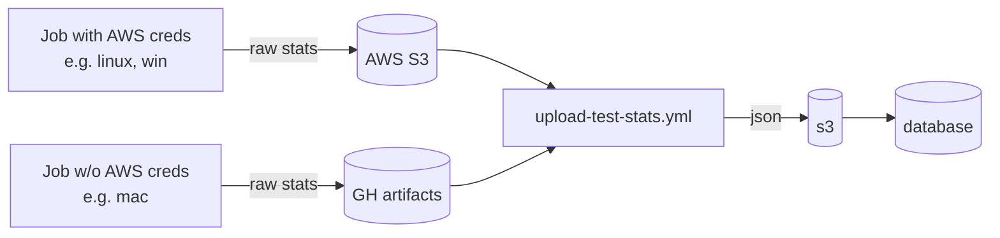

# Documentation: `docs/tools/stats/README.md_docs.md`

## File Metadata

- **Path**: `docs/tools/stats/README.md_docs.md`
- **Size**: 3,899 bytes (3.81 KB)
- **Type**: Markdown Documentation
- **Extension**: `.md`

## File Purpose

This file is part of the **documentation**. This file is a **utility or tool script**.

## Original Source

```markdown
# Documentation: `tools/stats/README.md`

## File Metadata

- **Path**: `tools/stats/README.md`
- **Size**: 1,528 bytes (1.49 KB)
- **Type**: Markdown Documentation
- **Extension**: `.md`

## File Purpose

This file is a **utility or tool script**.

## Original Source

```markdown
# PyTorch CI Stats

We track various stats about each CI job.

1. Jobs upload their artifacts to an intermediate data store (either GitHub
   Actions artifacts or S3, depending on what permissions the job has). Example:
   https://github.com/pytorch/pytorch/blob/a9f6a35a33308f3be2413cc5c866baec5cfe3ba1/.github/workflows/_linux-build.yml#L144-L151
2. When a workflow completes, a `workflow_run` event [triggers
   `upload-test-stats.yml`](https://github.com/pytorch/pytorch/blob/d9fca126fca7d7780ae44170d30bda901f4fe35e/.github/workflows/upload-test-stats.yml#L4).
3. `upload-test-stats` downloads the raw stats from the intermediate data store
   and uploads them as JSON to s3, which then uploads to our database backend



Why this weird indirection? Because writing to the database requires special
permissions which, for security reasons, we do not want to give to pull request
CI. Instead, we implemented GitHub's [recommended
pattern](https://securitylab.github.com/research/github-actions-preventing-pwn-requests/)
for cases like this.

For more details about what stats we export, check out
[`upload-test-stats.yml`](https://github.com/pytorch/pytorch/blob/d9fca126fca7d7780ae44170d30bda901f4fe35e/.github/workflows/upload-test-stats.yml)

```


## High-Level Overview

This file is part of the PyTorch framework located at `tools/stats`.

## Detailed Analysis

### Code Structure


*For complete code details, see the Original Source section above.*


## Architecture & Design

### Role in PyTorch Architecture

This file is located in `tools/stats`, which contains **development tools and scripts**.


## Dependencies

### Import Dependencies

*Dependency analysis not applicable for this file type.*


## Code Patterns & Idioms

### Common Patterns

*No specific patterns automatically detected.*


## Performance Considerations

### Performance Notes


*Detailed performance analysis requires profiling and benchmarking.*


## Security & Safety

### Security Considerations

- No obvious security concerns detected in automated analysis.

*Manual security review is recommended for production code.*


## Testing & Usage

### Testing

Test files for this module may be located in the `test/` directory.

### Usage Examples

*See the source code and related test files for usage examples.*


## Related Files

### Related Files

Files in the same folder (`tools/stats`):

- [`__init__.py_docs.md`](./__init__.py_docs.md)
- [`upload_sccache_stats.py_docs.md`](./upload_sccache_stats.py_docs.md)
- [`upload_external_contrib_stats.py_docs.md`](./upload_external_contrib_stats.py_docs.md)
- [`check_disabled_tests.py_docs.md`](./check_disabled_tests.py_docs.md)
- [`upload_metrics.py_docs.md`](./upload_metrics.py_docs.md)
- [`import_test_stats.py_docs.md`](./import_test_stats.py_docs.md)
- [`utilization_stats_lib.py_docs.md`](./utilization_stats_lib.py_docs.md)
- [`upload_artifacts.py_docs.md`](./upload_artifacts.py_docs.md)
- [`upload_test_stats_intermediate.py_docs.md`](./upload_test_stats_intermediate.py_docs.md)
- [`export_test_times.py_docs.md`](./export_test_times.py_docs.md)


## Cross-References

- **File Documentation**: `README.md_docs.md`
- **Keyword Index**: `README.md_kw.md`
- **Folder Index**: `index.md`
- **Folder Documentation**: `doc.md`

---

*Generated by PyTorch Repository Documentation System*

```


## High-Level Overview

This file is part of the PyTorch framework located at `docs/tools/stats`.

## Detailed Analysis

### Code Structure


*For complete code details, see the Original Source section above.*


## Architecture & Design

### Role in PyTorch Architecture

This file is located in `docs/tools/stats`, which contains **development tools and scripts**.


## Dependencies

### Import Dependencies

*Dependency analysis not applicable for this file type.*


## Code Patterns & Idioms

### Common Patterns

*No specific patterns automatically detected.*


## Performance Considerations

### Performance Notes

- Implements or uses **caching** mechanisms.
- Contains **benchmarking** code or performance tests.

*Detailed performance analysis requires profiling and benchmarking.*


## Security & Safety

### Security Considerations

- No obvious security concerns detected in automated analysis.

*Manual security review is recommended for production code.*


## Testing & Usage

### Testing

Test files for this module may be located in the `test/` directory.

### Usage Examples

*See the source code and related test files for usage examples.*


## Related Files

### Related Files

Files in the same folder (`docs/tools/stats`):

- [`upload_dynamo_perf_stats.py_docs.md_docs.md`](./upload_dynamo_perf_stats.py_docs.md_docs.md)
- [`check_disabled_tests.py_kw.md_docs.md`](./check_disabled_tests.py_kw.md_docs.md)
- [`import_test_stats.py_docs.md_docs.md`](./import_test_stats.py_docs.md_docs.md)
- [`upload_artifacts.py_docs.md_docs.md`](./upload_artifacts.py_docs.md_docs.md)
- [`upload_stats_lib.py_kw.md_docs.md`](./upload_stats_lib.py_kw.md_docs.md)
- [`test_dashboard.py_docs.md_docs.md`](./test_dashboard.py_docs.md_docs.md)
- [`upload_test_stats.py_kw.md_docs.md`](./upload_test_stats.py_kw.md_docs.md)
- [`utilization_stats_lib.py_docs.md_docs.md`](./utilization_stats_lib.py_docs.md_docs.md)
- [`upload_test_stats_running_jobs.py_kw.md_docs.md`](./upload_test_stats_running_jobs.py_kw.md_docs.md)


## Cross-References

- **File Documentation**: `README.md_docs.md_docs.md`
- **Keyword Index**: `README.md_docs.md_kw.md`
- **Folder Index**: `index.md`
- **Folder Documentation**: `doc.md`

---

*Generated by PyTorch Repository Documentation System*
