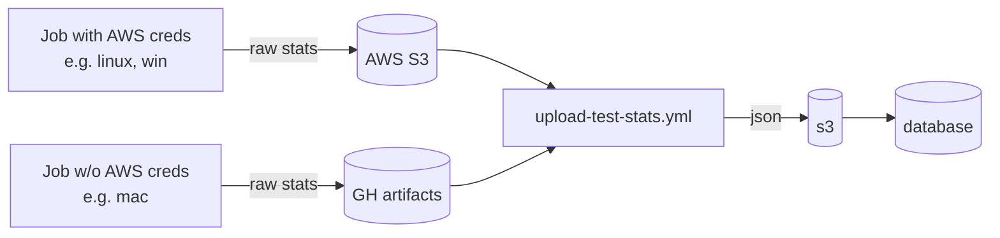

# Documentation: README.md

## File Metadata
- **Path**: `tools/stats/README.md`
- **Size**: 1528 bytes
- **Lines**: 32
- **Extension**: .md
- **Type**: Regular file

## Original Source

```md
# PyTorch CI Stats

We track various stats about each CI job.

1. Jobs upload their artifacts to an intermediate data store (either GitHub
   Actions artifacts or S3, depending on what permissions the job has). Example:
   https://github.com/pytorch/pytorch/blob/a9f6a35a33308f3be2413cc5c866baec5cfe3ba1/.github/workflows/_linux-build.yml#L144-L151
2. When a workflow completes, a `workflow_run` event [triggers
   `upload-test-stats.yml`](https://github.com/pytorch/pytorch/blob/d9fca126fca7d7780ae44170d30bda901f4fe35e/.github/workflows/upload-test-stats.yml#L4).
3. `upload-test-stats` downloads the raw stats from the intermediate data store
   and uploads them as JSON to s3, which then uploads to our database backend



Why this weird indirection? Because writing to the database requires special
permissions which, for security reasons, we do not want to give to pull request
CI. Instead, we implemented GitHub's [recommended
pattern](https://securitylab.github.com/research/github-actions-preventing-pwn-requests/)
for cases like this.

For more details about what stats we export, check out
[`upload-test-stats.yml`](https://github.com/pytorch/pytorch/blob/d9fca126fca7d7780ae44170d30bda901f4fe35e/.github/workflows/upload-test-stats.yml)

```

## High-Level Overview

This file is part of the PyTorch repository. It is a documentation file written in Markdown or reStructuredText.

## Detailed Walkthrough


## Key Components

The file contains 154 words across 32 lines of code/text.

## Usage & Examples

This file is part of the larger PyTorch codebase. For usage examples, refer to related test files and documentation.

## Performance & Security Notes

- File size: 1528 bytes
- Complexity: Standard

## Related Files

See the folder index for related files in the same directory.

## Testing

Refer to the PyTorch test suite for test coverage of this file.

---
*Generated by Repo Book Generator v1.0*
